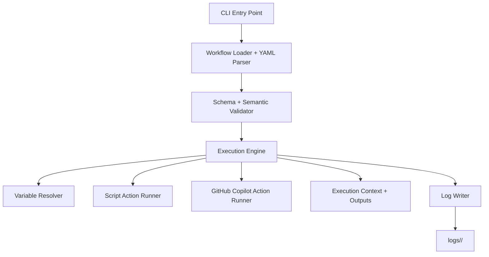

# AI Orchestrator CLI - Design Plan

## 1. Goal

Build a C# `.NET 10` CLI tool that executes configurable AI workflows from a project folder.

A workflow project folder will contain:
- a YAML workflow definition file
- supporting files referenced by actions
- optional templates, prompts, scripts, and assets
- a `logs/` folder created automatically for execution history

The orchestrator should:
- load a workflow from a target folder
- resolve variables, inputs, outputs, and environment variables
- execute actions in order
- support initial action types:
  - `script` for `bash` or `pwsh`
  - `githubCopilot` for prompting GitHub Copilot through the GitHub Copilot SDK
- persist detailed execution logs per run

---

## 2. Core Product Vision

The tool should feel like a lightweight mix of:
- GitHub Actions workflow concepts
- local task orchestration
- AI-assisted automation

The main difference from GitHub Actions is that this runs locally against a project folder and can use AI actions as first-class workflow steps.

---

## 3. Primary Use Cases

### Initial use cases
- Run local automation workflows against a repository or content folder
- Generate or transform files with Copilot prompts
- Run scripts before and after AI actions
- Chain outputs from one action into later actions
- Create repeatable local AI pipelines with logs and reproducibility

### Example scenarios
- Analyze a codebase, then generate a report
- Run a build script, ask Copilot to fix issues, then run tests again
- Generate docs from source files
- Apply prompt-driven repository transformations

---

## 4. Recommended MVP Scope

### In scope for v1
- Single CLI application
- Point CLI at a workflow project folder
- Load one YAML config file (for example `orchestrator.yml`)
- Sequential execution of actions with explicit transitions
- Conditional action execution similar to GitHub Actions
- Controlled workflow loops by jumping back to a prior action when conditions match
- Variable resolution
- Environment variable lookup
- Action inputs and outputs
- `script` action
- `githubCopilot` action
- Structured logs on disk
- Exit code based on workflow success/failure

### Out of scope for v1
- Parallel actions
- Matrix builds
- Remote execution
- Distributed agents
- Visual UI
- Workflow marketplace
- Secrets vault integration beyond environment variables
- Resume/retry from arbitrary checkpoint
- Arbitrary unbounded looping without configured safeguards

---

## 5. Proposed High-Level Architecture



### Main layers
1. **CLI Layer**
   - command parsing
   - folder selection
   - options such as dry run / verbose / log level

2. **Configuration Layer**
   - YAML loading
   - schema validation
   - normalization into internal models

3. **Runtime Layer**
   - workflow execution engine
   - action dispatching
   - context/state management

4. **Integration Layer**
   - shell process execution
   - GitHub Copilot SDK integration

5. **Observability Layer**
   - console output
   - structured logs
   - per-run artifacts

---

## 6. Proposed Solution Structure

Recommended repository layout:

```text
/src
  /Powergentic.AI.Orchestrator.Cli
  /Powergentic.AI.Orchestrator.Core
  /Powergentic.AI.Orchestrator.Actions.Script
  /Powergentic.AI.Orchestrator.Actions.GitHubCopilot
  /Powergentic.AI.Orchestrator.Yaml
  /Powergentic.AI.Orchestrator.Logging
/tests
  /Powergentic.AI.Orchestrator.Core.Tests
  /Powergentic.AI.Orchestrator.IntegrationTests
/samples
  /basic-script
  /copilot-review
  /script-and-copilot-pipeline
```

### Project responsibilities

#### `Powergentic.AI.Orchestrator.Cli`
- `System.CommandLine` based CLI
- commands/options
- startup and dependency injection

#### `Powergentic.AI.Orchestrator.Core`
- workflow domain models
- execution engine
- variable resolution
- action contracts
- context and result models

#### `Powergentic.AI.Orchestrator.Actions.Script`
- bash/pwsh execution
- process output capture
- exit code handling

#### `Powergentic.AI.Orchestrator.Actions.GitHubCopilot`
- adapter over GitHub Copilot SDK
- prompt submission
- result parsing
- file/artifact capture if needed

#### `Powergentic.AI.Orchestrator.Yaml`
- YAML parsing
- schema mapping
- validation helpers

#### `Powergentic.AI.Orchestrator.Logging`
- console logging
- JSON log/event writer
- run folder creation

---

## 7. Workflow Project Folder Design

A workflow project folder might look like this:

```text
my-workflow-project/
  orchestrator.yml
  prompts/
    review.prompt.md
  scripts/
    setup.sh
    summarize.ps1
  assets/
    context.txt
  logs/
    2026-06-02T20-10-15Z_4fcb9d2f/
      run.json
      console.log
      actions/
        01-setup.json
        02-review.json
```

### Conventions
- `orchestrator.yml` is the default config filename
- `logs/` is ignored by workflow logic except as output storage
- relative file references resolve from the workflow project folder

---

## 8. YAML Workflow Model

## Top-level design

Suggested top-level sections:
- `name`
- `description`
- `version`
- `variables`
- `env`
- `execution`
- `actions`

### Example YAML

```yaml
name: Code Review Workflow
version: 1
variables:
  reportFile: output/review.md
  targetPath: ${ env.PROJECT_PATH }
  enableReview: true

env:
  COPILOT_MODEL: gpt-5-codex

execution:
  startAt: setup
  maxTransitions: 25
  maxVisitsPerAction: 10

actions:
  - id: setup
    name: Gather files
    uses: script
    with:
      shell: bash
      path: scripts/setup.sh
    outputs:
      fileList: files.txt

  - id: review
    name: Review repository
    if: ${{ success() && variables.enableReview == true }}
    uses: githubCopilot
    with:
      promptFile: prompts/review.prompt.md
      inputs:
        fileListPath: ${ actions.setup.outputs.fileList }
        targetPath: ${ variables.targetPath }
      writeResponseTo: ${ variables.reportFile }
    outputs:
      reportPath: ${ variables.reportFile }
      needsChanges: ${ actions.review.outputs.needsChanges }
    next:
      - when: ${{ actions.review.outputs.needsChanges == 'true' }}
        goto: fix
      - goto: done

  - id: fix
    name: Apply fixes
    if: ${{ success() }}
    uses: githubCopilot
    with:
      prompt: |
        Update the project at ${ variables.targetPath } using the findings in ${ variables.reportFile }.
    outputs:
      retryReview: ${ actions.fix.outputs.retryReview }
    next:
      - when: ${{ actions.fix.outputs.retryReview == 'true' }}
        goto: review
      - goto: done

  - id: done
    name: Finish
    if: ${{ always() }}
    uses: script
    with:
      shell: bash
      run: echo "Workflow completed"
```

### Notes
- `uses` identifies the action type
- `with` contains action-specific parameters
- `if` allows GitHub Actions-like conditional execution for each action
- `next` defines explicit control-flow transitions after an action completes
- if `next` is omitted, execution falls through to the next action in file order
- `goto` may point to a previous action to form a loop
- workflow-level safeguards such as `maxTransitions` and `maxVisitsPerAction` prevent accidental infinite loops
- expressions should support references to:
  - `variables.*`
  - `env.*`
  - `actions.<id>.outputs.*`
  - `actions.<id>.status`
  - `runtime.*`

---

## 9. Expression and Variable Resolution Model

Use two expression styles:

### String interpolation syntax
For values such as paths, prompts, env entries, and action inputs:
- `${ variables.name }`
- `${ env.MY_VAR }`
- `${ actions.step1.outputs.result }`
- `${ runtime.projectFolder }`
- `${ runtime.runId }`

### Conditional expression syntax
For `if` and `next.when`, use a GitHub Actions-like boolean expression form:
- `${{ variables.enableReview == true }}`
- `${{ actions.review.outputs.needsChanges == 'true' }}`
- `${{ success() && env.MODE != 'dry-run' }}`
- `${{ always() }}`

### Supported condition features for MVP
- equality and inequality: `==`, `!=`
- boolean operators: `&&`, `||`, `!`
- parentheses
- booleans, strings, and null checks
- status helpers similar to GitHub Actions:
  - `success()`
  - `failure()`
  - `always()`

### Resolution order
1. runtime values
2. workflow variables
3. environment variables
4. completed action outputs and statuses

### Rules
- unresolved expressions should fail validation or execution with clear errors
- action outputs and statuses are only available after that action completes
- interpolation expressions should stay string-oriented
- condition expressions should be evaluated by a restricted boolean expression engine, not by arbitrary code execution

### Recommendation
Use **string templating for values** and a **small, explicit boolean condition language** for control flow. Do not introduce a general-purpose scripting language for expressions in v1.

---

## 10. Execution Context Design

The execution engine should maintain a runtime context object containing:
- workflow metadata
- project folder path
- run id
- start/end timestamps
- resolved variables
- environment snapshot subset
- action execution results
- outputs produced so far
- current action pointer
- transition count
- per-action visit counts for loop protection
- logger handles

### Suggested core types
- `WorkflowDefinition`
- `WorkflowExecutionOptions`
- `WorkflowActionDefinition`
- `WorkflowTransitionDefinition`
- `ExecutionContext`
- `ActionExecutionContext`
- `ActionResult`
- `WorkflowRunResult`
- `IActionRunner`

---

## 11. Action Contract Design

Define a shared interface for all action runners.

### Suggested shape
- `bool CanRun(string actionType)`
- `Task<ActionResult> RunAsync(ActionExecutionContext context, CancellationToken cancellationToken)`

### Action-level control flow metadata
Each action definition should support:
- `if`: optional condition that determines whether the action runs, similar to GitHub Actions
- `next`: optional ordered list of conditional transitions
- default fallthrough to the next action in file order when no `next` rule matches

Each `next` entry should support:
- `when`: optional condition expression
- `goto`: target action id

This allows workflows to:
- skip actions conditionally
- branch to another action
- jump back to a previous action and form a loop

### `ActionResult` should include
- success/failure
- execution status such as `succeeded`, `failed`, or `skipped`
- exit code or status code
- outputs dictionary
- summary message
- structured metadata
- optional artifact paths
- captured stdout/stderr references if applicable

This contract allows future actions to be added cleanly while preserving runtime control-flow decisions.

---

## 12. Script Action Design

## Supported shells
- `bash`
- `pwsh`

### Inputs
Suggested `with` fields:
- `shell`: `bash` or `pwsh`
- `run`: inline script text
- `file`: optional script file path instead of inline text
- `path`: optional script path within the workflow project folder
- `workingDirectory`: optional relative/absolute path
- `environment`: optional env overrides
- `failOnNonZeroExit`: default `true`

### Behavior
- support either inline script content (`run`) or a script file reference (`file`/`path`)
- allow script files that live inside the workflow project folder, such as `scripts/setup.sh` or `scripts/summarize.ps1`
- treat relative script paths as relative to the workflow project folder
- validate that referenced script files exist before execution
- resolve variables before execution
- create temp script file for inline script if needed
- execute referenced project-local script files directly when configured
- capture stdout/stderr
- write raw output to run log files
- support output extraction

### Output strategy options
For MVP, support one or both:

1. **Explicit output mapping from files**
   - script writes to known file
   - action returns path as output

2. **GitHub Actions-like output file**
   - provide an env var like `ORCHESTRATOR_OUTPUT`
   - script writes lines such as `name=value`
   - runtime parses and registers outputs

### Recommendation
Implement `ORCHESTRATOR_OUTPUT` for the best GitHub Actions-like experience.

---

## 13. GitHub Copilot Action Design

This action should wrap the GitHub Copilot SDK behind an internal abstraction so the runtime is not tightly coupled to SDK details.

### Inputs
Suggested `with` fields:
- `prompt`: inline prompt text
- `promptFile`: path to prompt template file
- `inputs`: dictionary of prompt variables
- `model`: optional model hint if SDK supports it
- `workingDirectory`: optional project context path
- `writeResponseTo`: optional output file path
- `systemPrompt`: optional system instruction
- `conversationId`: optional future extension

### Behavior
- load prompt from inline text or file
- resolve template variables
- invoke Copilot SDK
- capture response text and metadata
- optionally write response to file
- return outputs such as:
  - `response`
  - `responseFile`
  - `tokenUsage` if available
  - `conversationId` if available

### Important implementation note
The exact SDK API surface may vary. The design should isolate this behind:
- `ICopilotClient`
- `CopilotPromptRequest`
- `CopilotPromptResponse`

This protects the rest of the system if SDK details change.

---

## 14. Logging and Run History Design

Each workflow execution should create a unique run folder under `logs/`.

### Suggested structure

```text
logs/
  <run-id>/
    run.json
    console.log
    workflow-resolved.yml
    actions/
      01-setup.json
      01-setup.stdout.log
      01-setup.stderr.log
      02-review.json
```

### What to record
- original workflow file path
- resolved workflow snapshot
- start/end times
- success/failure summary
- each action's inputs after resolution
- each action's outputs
- stdout/stderr for script actions
- Copilot request/response summaries
- exception details and stack traces for failures

### Recommendation
Use both:
- human-readable console logging
- structured JSON logs for machine analysis

---

## 15. Validation Strategy

Validation should happen before execution where possible.

### Validation phases
1. **Schema validation**
   - required fields present
   - types are correct
   - `if`, `next`, `goto`, and execution guard fields have valid shapes

2. **Semantic validation**
   - unique action IDs
   - referenced action outputs are from earlier actions only unless the reference appears inside a loop-safe conditional transition
   - referenced files exist where required
   - supported action type names only
   - shell values are valid
   - all `goto` targets exist
   - `startAt` points to a valid action id when configured
   - loop guard values such as `maxTransitions` and `maxVisitsPerAction` are positive and reasonable
   - detect obviously invalid control-flow definitions such as dead targets or unconditional self-loops without safeguards

3. **Runtime validation**
   - environment variables required at runtime exist
   - SDK availability/authentication is valid
   - loop guard thresholds are enforced during execution

### Error quality requirement
Validation errors should be precise and include:
- workflow file
- action id/name
- field path
- expected value/type
- suggested fix when possible

---

## 16. CLI Design

### Recommended commands

```text
pgflow run <project-folder>
pgflow validate <project-folder>
pgflow init <project-folder>
pgflow logs <project-folder> [--latest]
```

### Recommended options
- `--workflow <file>` override default workflow filename
- `--var key=value` override workflow variables
- `--env key=value` inject/override env values for a run
- `--dry-run` resolve and validate without executing actions
- `--verbose`
- `--json`

### Command behavior
- `run`: validate then execute
- `validate`: parse and validate only
- `init`: scaffold a sample workflow project
- `logs`: show latest run summary or a selected run

---

## 17. Configuration Schema Evolution Strategy

Use a versioned workflow schema.

### Recommendation
Include:

```yaml
version: 1
```

This allows future evolution without breaking old workflows.

Possible later additions:
- advanced condition functions and richer expressions
- retries
- parallel groups
- reusable workflow includes
- sub-workflows and cross-file workflow composition
- secret providers
- artifact management

---

## 18. Suggested Internal Domain Model

### WorkflowDefinition
- `Name`
- `Description`
- `Version`
- `Variables`
- `Environment`
- `Execution`
- `Actions`

### WorkflowExecutionOptions
- `StartAt`
- `MaxTransitions`
- `MaxVisitsPerAction`

### WorkflowActionDefinition
- `Id`
- `Name`
- `Uses`
- `With`
- `Outputs`
- `If`
- `Next`

### WorkflowTransitionDefinition
- `When`
- `Goto`

### WorkflowRunResult
- `RunId`
- `Succeeded`
- `StartedAt`
- `CompletedAt`
- `TransitionCount`
- `ActionResults`
- `LogFolder`

---

## 19. Dependencies to Consider

### Core packages
- `System.CommandLine`
- `Microsoft.Extensions.Hosting`
- `Microsoft.Extensions.DependencyInjection`
- `Microsoft.Extensions.Logging`
- `YamlDotNet`
- `FluentValidation` or custom validation layer

### Testing
- `xUnit`
- `FluentAssertions`
- `Verify` for snapshot tests

### Copilot integration
- GitHub Copilot SDK package(s), depending on the supported official API surface at implementation time

---

## 20. Security and Safety Considerations

This tool executes scripts and AI-driven instructions locally, so safety matters.

### MVP safeguards
- clearly show project folder and workflow file being executed
- log all resolved action definitions except sensitive values
- redact sensitive environment variables in logs
- fail fast on missing required env vars
- avoid automatically executing generated scripts unless explicitly configured

### Later safeguards
- allow-list action types
- prompt approval mode for dangerous actions
- restricted mode / no-network mode
- secret classification and masking

---

## 21. Testing Strategy

### Unit tests
- YAML parsing
- variable resolution
- action dependency resolution
- log path generation
- output parsing from scripts

### Integration tests
- run sample workflows end-to-end
- script action on macOS/Linux/Windows where possible
- Copilot action mocked through `ICopilotClient`
- validation failures and log generation

### Snapshot tests
- resolved workflow output
- JSON run summaries
- action output mapping behavior

---

## 22. Implementation Phases

### Phase 1 - Foundation
- create solution and projects
- set up CLI host and DI
- define domain models
- add YAML loading
- add validation pipeline

### Phase 2 - Runtime Engine
- implement execution context
- implement sequential action dispatcher with explicit transitions
- implement `if` evaluation and `next/goto` resolution
- implement loop guard enforcement (`maxTransitions`, `maxVisitsPerAction`)
- implement result aggregation
- implement logging/run folder creation

### Phase 3 - Script Action
- add bash/pwsh runners
- capture stdout/stderr
- add output file parsing
- add tests

### Phase 4 - GitHub Copilot Action
- add Copilot client abstraction
- integrate SDK
- support prompt file/input substitution
- support writing responses to files
- add mocked tests

### Phase 5 - CLI Experience
- add `validate`, `run`, `init`, `logs`
- add verbose/JSON output modes
- add sample workflow projects

### Phase 6 - Hardening
- improve diagnostics
- redact secrets
- improve schema docs
- add more integration coverage

---

## 23. Recommended MVP Decisions

To keep the first version focused, make these explicit choices:

1. **Single workflow file per project folder**
2. **Sequential execution with explicit conditional transitions**
3. **Limited GitHub Actions-like condition language, not a full expression engine**
4. **Loops are allowed only through explicit `goto` transitions with runtime safeguards**
5. **Action outputs are dictionary-based strings initially**
6. **Copilot integration behind an internal adapter**
7. **Logs stored per run in `logs/<run-id>/`**
8. **Relative paths resolve from the project folder**

These choices reduce complexity while preserving a strong foundation.

---

## 24. Open Questions to Resolve Early

1. What exact GitHub Copilot SDK/API will be used in .NET?
2. Will Copilot actions be chat-based, prompt-based, or agent-based?
3. Should script outputs support only strings initially, or JSON objects too?
4. Should workflow variables support command-line overrides from day one?
5. Should `init` scaffold multiple templates?
6. How much of the Copilot request/response should be persisted in logs?
7. How should auth and SDK session state be handled locally?
8. What should the default loop safeguards be for `maxTransitions` and `maxVisitsPerAction`?
9. Should skipped actions count toward loop/transition totals?

---

## 25. Recommended Next Step

Start by implementing the non-AI foundation first:
- solution structure
- CLI
- YAML parser
- validation
- execution engine
- script action
- run logging

Then add the `githubCopilot` action behind a stable abstraction once the exact SDK integration details are confirmed.

This will produce a usable orchestrator quickly while reducing risk around the Copilot integration layer.
