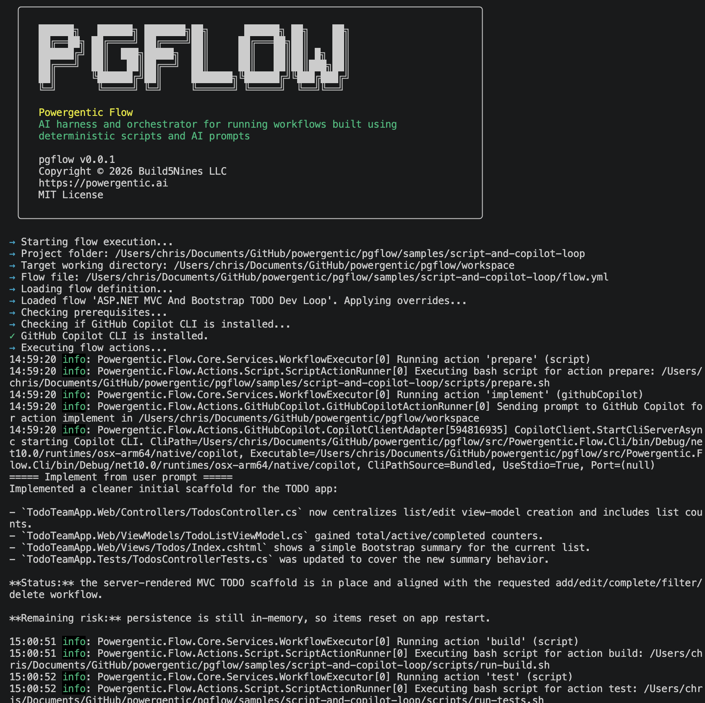

# Powergentic Flow

`pgflow` is an AI harness and orchestrator for running workflows built using deterministic scripts and AI prompts within a `pgflow` project folder taking actions within a target working directory.



## What pgflow does

- Loads a workflow from `flow.yml` in a pgflow project folder
- Resolves workflow assets like prompt files and scripts from that project folder
- Executes actions against a target working directory chosen at run time
- Runs `script` actions with `bash` or `pwsh`
- Runs `githubCopilot` actions through the internal Copilot adapter
- Executes actions sequentially by default
- Uses `next` only when a workflow needs to override the default next action
- Writes per-run logs under the pgflow project folder

## Requirements

- .NET SDK 10.0 or newer
- `bash` on macOS/Linux or `pwsh` for PowerShell-based workflows
- GitHub Copilot access for workflows that use `githubCopilot`
- optionally `GITHUB_TOKEN` if token-based auth is preferred

## Quick start

From the repository root:

```bash
dotnet build Powergentic.Flow.slnx
dotnet test Powergentic.Flow.slnx
dotnet run --project src/Powergentic.Flow.Cli -- run samples/basic-script
```

The last command uses `samples/basic-script` as both the pgflow project folder and the target working directory because the current shell directory is used by default when `--workdir` is not supplied.

## CLI usage

```text
pgflow <command> [project-folder] [options]
pgflow run <project-folder> [target-working-directory] [options]
pgflow [project-folder] [target-working-directory] [workflow-file]
```

Defaults:

- `project-folder` defaults to the current directory
- `target-working-directory` defaults to the current shell directory for `run`
- `workflow-file` defaults to `flow.yml`

### Commands

- `pgflow run [project-folder] [target-working-directory]` - validate and execute a workflow
- `pgflow validate [project-folder]` - load and validate a workflow
- `pgflow init [project-folder]` - scaffold a workflow project
- `pgflow logs [project-folder]` - show the latest run summary or a selected run
- `pgflow help` - show help information
- `pgflow version` - show the current version

### Common options

- `-h`, `--help` - show help information
- `--workflow <file>` - override the default workflow file name
- `--workdir <path>` - override the target working directory for `run`
- `--input key=value` - override a workflow input
- `--var key=value` - override a workflow variable
- `--env key=value` - inject or override an environment value
- `--dry-run` - validate without executing actions
- `--template <name>` - template for `init`
- `--run-id <id>` - select a specific run for `logs`
- `--latest` - show the latest run summary
- `--force` - allow `init` in a non-empty folder
- `--verbose` - enable verbose console logging
- `--json` - emit JSON output

### Examples

Validate a workflow:

```bash
pgflow validate samples/basic-script
```

Run a workflow against the current shell directory:

```bash
pgflow run samples/basic-script
```

Run a workflow against another repository:

```bash
pgflow run samples/script-and-copilot-loop ../my-project
```

Run the same workflow with an explicit option instead:

```bash
pgflow run samples/script-and-copilot-loop --workdir ../my-project
```

Run with input, variable, and environment overrides:

```bash
pgflow run samples/basic-script --input audience=Developers --var greeting=Hello --env NAME=Chris
```

## Project folder versus target working directory

A pgflow project folder contains the reusable automation harness:

- `flow.yml`
- prompt templates
- helper scripts
- logs

The target working directory is the actual project or content folder the workflow should operate on.

Resolution rules:

- workflow asset paths such as `promptFile`, `path`, and `file` resolve from the pgflow project folder
- `script` and `githubCopilot` actions run in the target working directory by default
- a relative `workingDirectory` override resolves from the target working directory
- logs always go under `<project-folder>/logs/<run-id>/`
- `githubCopilot.with.writeResponseTo` resolves from the target working directory

## Workflow behavior

Top-level fields:

- `name`
- `description`
- `version`
- `inputs`
- `variables`
- `env`
- `execution`
- `actions`

Common action fields:

- `id`
- `name`
- `uses`
- `if`
- `with`
- `outputs`
- `publish`
- `next`

Execution rules:

- actions run in file order by default
- if an action's `if` condition is false, that action is skipped and execution continues to the next action in file order
- use `next.when` to branch conditionally
- use `next.goto` only when the next action should not be the next action defined in the file

## Script actions

Example:

```yaml
- id: hello
  uses: script
  with:
    shell: bash
    path: scripts/hello.sh
    environment:
      GREETING: Hello
```

Supported `with` fields:

- `shell`: `bash` or `pwsh`
- `run`: inline script content
- `file` or `path`: script file path in the pgflow project folder
- `workingDirectory`: optional override, resolved from the target working directory if relative
- `environment`: extra environment variables
- `failOnNonZeroExit`: defaults to `true`

Runtime environment variables exposed to scripts:

- `ORCHESTRATOR_OUTPUT`
- `ORCHESTRATOR_PROJECT_FOLDER`
- `ORCHESTRATOR_TARGET_WORKING_DIRECTORY`
- `ORCHESTRATOR_RUN_ID`

Scripts can emit outputs by appending `key=value` lines to `$ORCHESTRATOR_OUTPUT`.

## GitHub Copilot actions

Example:

```yaml
- id: review
  uses: githubCopilot
  with:
    promptFile: prompts/review.prompt.md
    inputs:
      statusFile: ${ actions.prepare.outputs.statusFile }
      targetPath: ${ runtime.targetWorkingDirectory }
    writeResponseTo: output/review.txt
```

Supported `with` fields:

- `prompt` or `promptFile`
- `inputs`
- `writeResponseTo`
- `workingDirectory`
- `model`
- `systemPrompt`
- `streaming`
- `gitHubToken`
- `requestHeaders`

Prompt placeholders support both `{{name}}` and `${name}` forms.

### Publish behavior

If an action does not define `publish`, pgflow will automatically publish `actions.<id>.outputs.response` to both:

- `console`
- `runSummary`

If `publish` is defined, that explicit configuration overrides the default behavior.

Example:

```yaml
- id: analyze
  uses: githubCopilot
  with:
    promptFile: prompts/final-analysis.prompt.md
  publish:
    - title: Final analysis
      from: ${ actions.analyze.outputs.response }
      to:
        - console
        - runSummary
```

Supported `publish` fields:

- `title`
- `from`
- `to`
- `if`
- `maxLength`

## Runtime expressions

Useful runtime values include:

- `${ inputs.name }`
- `${ variables.name }`
- `${ runtime.projectFolder }`
- `${ runtime.targetWorkingDirectory }`
- `${ runtime.runId }`
- `${ runtime.logFolder }`
- `${ runtime.currentActionId }`

Workflow-level `inputs` are intended for caller-provided values, typically passed with `--input key=value`. Existing `variables` remain available for workflow-owned state and defaults.

## Logs

Each run writes under `<project-folder>/logs/<run-id>/`.

Typical files include:

- `workflow-resolved.json`
- `run.json`
- `actions/*.json`
- script stdout/stderr files when applicable

Inspect the latest run with:

```bash
pgflow logs <project-folder> --latest
```

## Samples

- `samples/basic-script` - minimal script-only workflow
- `samples/script-and-copilot-loop` - script + Copilot example that relies on sequential flow by default

## Solution layout

- `src/Powergentic.Flow.Cli` - CLI entrypoint
- `src/Powergentic.Flow.Core` - workflow models, validation, execution, logging
- `src/Powergentic.Flow.Actions.Script` - local script runner
- `src/Powergentic.Flow.Actions.GitHubCopilot` - Copilot action runner and adapter
- `tests/Powergentic.Flow.Core.Tests` - unit tests
